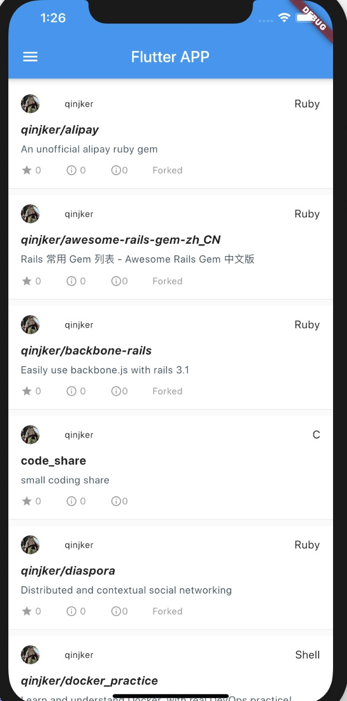

# flutter练习项目-HelperStartupNamer(GitMe)

flutter初学者，个把星期拼凑，勉强可以运行 ^_^

# 运行环境
flutter 1.13.7
dart 2.8.0

# 插件包
json_model： json定义数据模型转换为dart model类 很好用 good!
dio: API 请求神器
provider: 状态管理器，用着还不错
flukit:  UI组件库

# 完成
- 基础的git用户名密码登录API
- 获取当前用户的代码仓库列表
- 简单的屁股切换

# 未完成
- 登录错误提示
- 语言切换完整度

# 小总结
- 了解了flutter的基本项目结构
- 初识dart语言的一些基本语法
- 一些插件的基本用法

# 非常感谢
 https://github.com/wendux
 https://book.flutterchina.club

## 运行的一些截图

